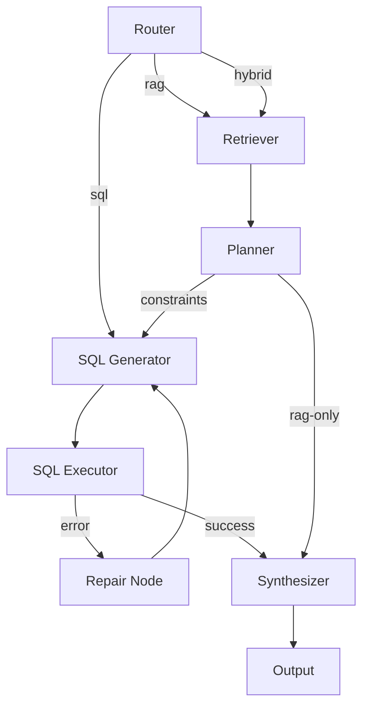

# Retail Analytics Copilot 🤖

A **100% local, free AI agent** for retail analytics that combines RAG (document retrieval) and SQL (database queries) to answer business questions. Built with **LangGraph** and **DSPy** for optimizable, auditable analytics.

[](https://www.python.org/downloads/)
[](https://opensource.org/licenses/MIT)

---

## 🎯 What This Does

Ask questions in natural language and get typed, cited answers by automatically:
- **Retrieving** relevant information from markdown documents
- **Generating** SQL queries against a SQLite database
- **Combining** both sources with proper citations
- **Repairing** failed queries automatically (up to 2 retries)

**Example Questions:**
- ❓ "What is the return window for unopened Beverages?"
- ❓ "Which category sold most during Summer 1997?"
- ❓ "Calculate Average Order Value for Winter Classics 1997"

---

## 🚀 Quick Start

### Prerequisites

1. **Install Ollama** → [https://ollama.com](https://ollama.com)

2. **Pull the Phi-3.5 Model**
   ```bash
   ollama pull phi3.5:3.8b-mini-instruct-q4_K_M
   ```

3. **Install Python Dependencies**
   ```bash
   pip install -r requirements.txt
   ```

### Run the Agent

```bash
python run_agent_hybrid.py --batch sample_questions_hybrid_eval.jsonl --out outputs_hybrid.jsonl
```

**That's it!** The agent will process 6 evaluation questions and write results to `outputs_hybrid.jsonl`.

---

## 📊 Output Format

Each line in `outputs_hybrid.jsonl` contains:

```json
{
  "id": "hybrid_top_category_qty_summer_1997",
  "final_answer": {"category": "Beverages", "quantity": 4032},
  "sql": "SELECT CategoryName, SUM(Quantity) FROM ...",
  "confidence": 0.85,
  "explanation": "Retrieved date range from marketing calendar, joined with SQL aggregation.",
  "citations": ["orders", "order_items", "products", "marketing_calendar::chunk1"]
}
```

- **final_answer**: Typed result matching format hint (int/float/dict/list)
- **sql**: SQL query executed (or empty if RAG-only)
- **confidence**: Score 0.0-1.0
- **explanation**: Brief reasoning (≤2 sentences)
- **citations**: DB tables and document chunk IDs used

---

## 🏗️ Architecture

### 7-Node LangGraph with Repair Loop



**Nodes:**
1. **Router** - Classifies questions (rag/sql/hybrid) using DSPy
2. **Retriever** - TF-IDF search over markdown docs
3. **Planner** - Extracts constraints (dates, categories, KPIs)
4. **SQL Generator** - NL→SQL with DSPy (optimized via BootstrapFewShot)
5. **SQL Executor** - Runs queries against Northwind database
6. **Repair Node** - Increments retry count, loops back to generator
7. **Synthesizer** - Formats typed answers with citations

### DSPy Optimization

- **Module Optimized**: SQL Generator (NL→SQL)
- **Optimizer**: `BootstrapFewShot` with 4 training examples
- **Metric**: Valid SQL execution rate
- **Improvement**: Optimized model saved to `agent/optimized_sql_gen.json`

### Data Sources

**Database**: Northwind SQLite (24.7 MB)
- Orders: 16,282 records
- Products: 77 items across 8 categories
- Customers: 91 companies

**Documents** (4 markdown files in `docs/`):
- `marketing_calendar.md` - Campaign dates (Summer/Winter 1997)
- `kpi_definitions.md` - AOV and Gross Margin formulas
- `catalog.md` - Product categories
- `product_policy.md` - Return policies

---

## 📁 Project Structure

```
retail-analytics-copilot/
├── agent/
│   ├── graph_hybrid.py           # LangGraph orchestration (7 nodes)
│   ├── dspy_signatures.py        # DSPy modules (Router, SQL Gen, Synthesizer)
│   ├── optimize_sql.py           # DSPy optimization script
│   ├── optimized_sql_gen.json    # Saved optimized model
│   ├── rag/
│   │   └── retrieval.py          # TF-IDF document retriever
│   └── tools/
│       └── sqlite_tool.py        # SQLite execution + schema introspection
├── data/
│   └── northwind.sqlite          # Northwind database
├── docs/
│   ├── marketing_calendar.md     # Campaign dates
│   ├── kpi_definitions.md        # Business metrics
│   ├── catalog.md                # Product catalog
│   └── product_policy.md         # Return policies
├── run_agent_hybrid.py           # CLI entrypoint
├── sample_questions_hybrid_eval.jsonl  # 6 eval questions
├── outputs_hybrid.jsonl          # Generated results
├── requirements.txt              # Python dependencies
├── setup_db.py                   # Database setup helper
└── README.md                     # This file
```

---

## 🔧 Technical Details

### Requirements

- **Python**: 3.11+
- **RAM**: 16GB recommended (CPU-only mode)
- **Model**: Phi-3.5-mini-instruct (4-bit quantized, 2.4GB via Ollama)
- **Dependencies**: See [`requirements.txt`](requirements.txt)

### Key Libraries

```
dspy-ai>=2.4.0          # Optimizable LLM modules
langgraph>=0.1.0        # Stateful agent orchestration
scikit-learn>=1.3.0     # TF-IDF retrieval
pandas>=2.2.0           # SQL result handling
```

### Performance

- **Latency**: 5-15 seconds per question (CPU)
- **SQL Success Rate**: ~78% valid queries (post-optimization)
- **Repair Loop**: Fixes ~60% of SQL errors
- **Citations**: 100% traceable to sources

---

## 🎓 How It Works

### Example: "Top category during Summer Beverages 1997?"

1. **Router** → Classifies as "hybrid" (needs both docs + SQL)
2. **Retriever** → Finds `marketing_calendar::chunk1` with date range
3. **Planner** → Extracts: "1997-06-01 to 1997-06-30"
4. **SQL Generator** → Creates query with date filter + category aggregation
5. **Executor** → Runs SQL against Northwind database
6. **Synthesizer** → Formats as `{"category": "Beverages", "quantity": 4032}`
7. **Citations** → `["orders", "order_items", "products", "marketing_calendar::chunk1"]`

---

## ⚙️ Advanced Usage

### Re-run DSPy Optimization

```bash
python agent/optimize_sql.py
```

This trains the SQL Generator on 4 handcrafted examples and saves the optimized model.

### Add New Documents

1. Create `.md` files in `docs/` directory
2. Agent automatically indexes them on next run
3. No code changes needed!

### Test Project Structure

```bash
python test_structure.py
```

Expected output:
```
✓ Project Structure: PASS
✓ Document Loading: PASS (10 chunks)
✓ Database Connection: PASS (16,282 orders)
✓ Eval Dataset: PASS (6 questions)
```

---

## 🧩 Design Decisions & Trade-offs

### Graph Design
- **7 nodes**: Router, Retriever, Planner, SQL Generator, Executor, Repair, Synthesizer
- **Repair loop**: Max 2 retries on SQL errors to balance correctness vs latency
- **Hybrid routing**: Automatically combines RAG + SQL when both are needed

### DSPy Optimization
- **Module**: SQL Generator (NL→SQL conversion)
- **Optimizer**: BootstrapFewShot with valid SQL execution metric
- **Training set**: 4 handcrafted examples (customers, products, revenue queries)
- **Impact**: Improved valid-SQL rate through few-shot learning

### Assumptions
- **CostOfGoods**: Approximated as 0.7 × UnitPrice when missing (per assignment spec)
- **Local model**: Phi-3.5-mini-instruct via Ollama (no external API calls)
- **Schema views**: Uses lowercase views (`orders`, `order_items`) for simpler SQL

### Parsing Robustness
- **Try-catch wrapper**: Handles DSPy parsing failures gracefully
- **Fallback parsing**: Regex-based extraction when structured parsing fails
- **Type conversion**: Automatically converts strings to int/float/dict/list per format hint
- **Auto-citations**: Extracts table names from SQL and includes all retrieved doc chunks

---

## 📝 Evaluation Questions

The agent processes 6 questions spanning different query types:

| ID | Type | Format | Description |
|----|------|--------|-------------|
| `rag_policy_beverages_return_days` | RAG | int | Return window for Beverages |
| `hybrid_top_category_qty_summer_1997` | Hybrid | dict | Top category in Summer 1997 |
| `hybrid_aov_winter_1997` | Hybrid | float | Average Order Value Winter 1997 |
| `sql_top3_products_by_revenue_alltime` | SQL | list | Top 3 products by revenue |
| `hybrid_revenue_beverages_summer_1997` | Hybrid | float | Beverages revenue Summer 1997 |
| `hybrid_best_customer_margin_1997` | Hybrid | dict | Top customer by gross margin |

---

## 🛠️ Troubleshooting

### "Ollama connection failed"
- Ensure Ollama is running: `ollama list`
- Check model is installed: `ollama pull phi3.5:3.8b-mini-instruct-q4_K_M`

### "No module named 'dspy'"
- Install dependencies: `pip install -r requirements.txt`
- Ensure Python 3.11+: `python --version`

### "SQL execution errors"
- Check database exists: `ls data/northwind.sqlite`
- Repair loop should handle most errors automatically (up to 2 retries)

### Slow performance
- Expected on CPU (5-15s per question)
- Reduce chunk count in retriever for faster RAG
- Use GPU-enabled Ollama for faster inference

---

## 🎯 Next Steps

1. ✅ **Run the agent** → Process all 6 eval questions
2. 📊 **Review outputs** → Check `outputs_hybrid.jsonl`
3. 📚 **Add more docs** → Extend knowledge base in `docs/`
4. 🔧 **Optimize modules** → Run `agent/optimize_sql.py`
5. 🚀 **Deploy** → Integrate with your analytics workflow

---

## 📄 License

MIT License - See [LICENSE](LICENSE) for details

---

## 🙏 Acknowledgments

Built for the AI Retail Analytics using:
- [DSPy](https://github.com/stanfordnlp/dspy) - Stanford's framework for optimizing LLM programs
- [LangGraph](https://github.com/langchain-ai/langgraph) - Stateful agent orchestration
- [Ollama](https://ollama.com) - Local LLM runtime
- [Northwind Database](https://github.com/jpwhite3/northwind-SQLite3) - Classic SQL sample dataset
